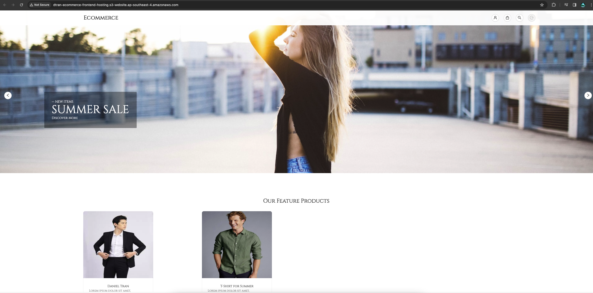

# Ecommerce Web Application

## Table of Contents

- [Overview](#overview)
- [Architecture Diagram](#architecture-diagram)
  - [Flow](#1-flow)
  - [AWS Architecture](#2-aws-architecture)  
- [Technologies](#technologies-specification)
  - [ReactJS](#1-reactjs)
  - [Java Spring Boot](#2-java-spring-boot-)
  - [GraphQL](#3-graphql)
  - [MongoDB](#4-mongodb)
  - [RabbitMQ](#5-rabbitmq)
- [Features](#features)

## Overview
Welcome to our E-Commerce Application! This application is designed to provide a seamless online shopping experience for users. It includes features for browsing products, managing user accounts, processing orders, and more. This README will guide you through the setup and usage of the application. 

This is a full-stack web application project from end to end including the development process which consisted of web frameworks like ReactJs and Java Spring Boot and the deployment process into AWS using different services.

## Architecture Diagram
### 1. Flow

### 2. AWS Architecture


## Usage

### 1. Prerequisite
It is required to have to Docker as the core prerequisite. For deployment purpose, I deployed to application into AWS and provision infrastructure there using Terraform. The details of deployment process will be specified later.
- [Docker](https://docs.docker.com/get-docker/)
- [AWS Account](https://aws.amazon.com/resources/create-account/) (For deployment purpose only)
- [Terraform](https://developer.hashicorp.com/terraform/tutorials/aws-get-started/install-cli) (For deployment purpose only)

### 2. Local Use
This project requires to launch Spring Boot server, React, RabbitMQ and MongoDB. 
It is recommended to use Docker specifically docker-compose to launch the whole application at once.
<br/>
<br/>
First, we will have to build the Spring Boot app in `ecommerce` directory. In `ecommerce` directory, run the following command to package Spring Boot Application.
It is required to package the Spring Boot App. You can either modify the Dockerfile.server so the build process of Java app will be comprehensively done in Docker.
```bash
./gradlew clean build
```
<br/>
Run the docker-compose command in the root directory of the project to launch the application:

```bash
docker compose up -d
```
or 

```bash
docker-compose up -d
```

The application now is accessible at port 80 of your own device.
<br/>

For more details about the deployment process into AWS, please refers to [Deployment Specification](#deployment-specification)

## Development Specification

### 1. ReactJS
The project employed ReactJS supported by AntDesign and TailwindCSS for rapid UI development. The source folder of the front-end development has been located in `ecommerce-views` directory.

### 2. Java Spring Boot 
As core part of the backend development, the project adopted Java Spring Boot. Spring Boot is one of a robust framework which enabled developers to rapidly create an enterprise scalable app. For mor information about Spring Boot, please refer to the official documentation at [docs.spring.io](https://docs.spring.io/spring-boot/docs/current/reference/htmlsingle/).

### 3. GraphQL
For better client's data retrieval, a GraphQL has been developed using Java Spring Boot. GraphQL enables client to rapidly query the only fields that has been defined in the schema from the backend server. Hence, it provides the proactivity for my development in React to query and mutate data efficiently.

#### a. [DGS Framework](https://netflix.github.io/dgs)
In the GraphQL development phase, DGS Framework has been used as one of the core library that supported Spring Boot to develop a GraphQL server. This library has been developed my Netflix and in my opinion, it is one of the most robust GraphQL library for Spring Boot. For more information, please refer to the official site of [DGS Framework](https://netflix.github.io/dgs/).

#### b. [Apollo Client](https://www.apollographql.com/docs/react/)
The client adopted Apollo Client for robust GraphQL operation to the server. Please refer to [Apollo Client](https://www.apollographql.com/docs/react) for mor information. 

### 4. MongoDB
MongoDB has been employed in this project to provide better data storage and flexible schema for the application.

### 5. RabbitMQ
In the development process, the application integrated with Stripe for virtual payment implementation. Because you can not retrieve that status of the deployment immediately so the queue
would be used for retrieving the status of the payment and store in the database later

## Features

### 1. Home Page
The home page using carousel and show up some products


### 2. Checking Product Detail
The product detail would provide information about that product in details.


### 3. Searching and Shopping Cart
The application enables to search for the products by their name and add to cart.


### 4. Authentication
User could log in and register to ecommerce application using their email.


### 5. Checkout
Stripe Integration to deliver check-out feature.


## AWS Deployment Specification

### 1. Prerequisite

The very first set up in deployment phase is launching MongoDB. Please refer to [Mongo Atlas](https://www.mongodb.com/) 
for more information. Please note that you can for you can either choose to enable VPC Peering Connection or just simple
database deployment (free tier eligible)

### 2. Infrastructure Provisioning
The whole infrastructure would be provisioned using Terraform which has been located in `k8s-infra` directory.
<br/>
From the `k8s-infra` directory, initialize terraform project:
```bash
terraform init
```
To apply the configuration:
```bash
terraform apply -var-file=variables.tfvars -auto-approve
```

Note that it is essential to export the aws access key and secret key and install AWS CLI in your local machine to run Terraform. <br/><br/>
The application is going to be deployed in EKS. To expose the back-end and front-end service, I ultilized Application Load
Balancer. For setting up EKS cluster with ALB, please refer to https://docs.aws.amazon.com/eks/latest/userguide/alb-ingress.html.

### 3. Config Map and Secrets
Specify the non-critical data in the application configmap. Credentials like DB password or RabbitMQ username and password should be stored
in the format of encoded base 64 string. To apply the configuration:
```bash
kubectl apply -f config-map.yaml
```

For the secrets:
```bash
kubectl apply -f secrets.yaml
```

### 4. Pods Deployment
To apply the deployment into the cluster, apply all the deployment declarative files in `k8s-spec` directory. Note that it is essential to push the image
into Docker Registry beforehand so the image could pull the image
